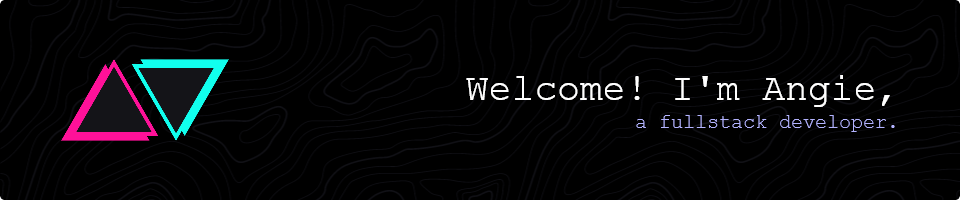

<h3 align="center">I write beautiful code for beautiful designs.</h3>

🚀 Currently leading Android development at a <a href="https://www.alchemistone.io/" target="_blank">AlchemistOne</a>, shaping the app’s architecture and features!

<!-- 
👉 You should check out <a href="https://github.com/AngelaVilladiego/memomi" target="_blank">Memomi</a>, my hackathon project which <b>won 3rd place in Cohere's prize category</b>

⚒️ I recently completed <a href="https://github.com/AngelaVilladiego/BoardForgeAR_HoloLens2" target="_blank">an AR project for the HoloLens 2</a>
 -->

 

 
  
  

  

 
 

  

